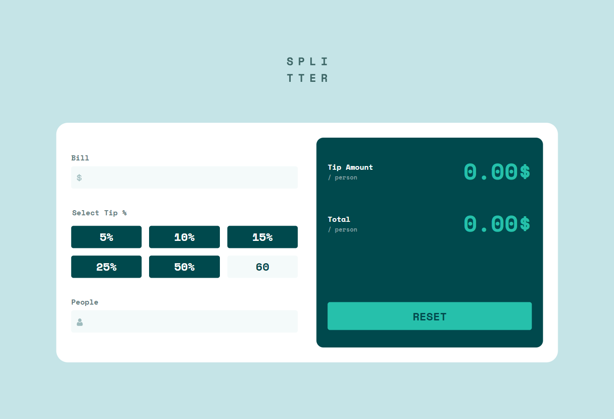

# Tip calculator app 
Simple tip calculator created for the purpose of practicing with vitest and unit testing.

## Table of contents

- [Overview](#overview)
  - [Screenshot](#screenshot)
- [My process](#my-process)
  - [Built with](#built-with)
  - [What I learned](#what-i-learned)
- [Author](#author)
- [Acknowledgments](#acknowledgments)

## Overview

### Screenshot

## My process

### Built with

- Semantic HTML5 markup
- CSS custom properties
- Flexbox
- CSS Grid
- Mobile-first workflow
- [React](https://reactjs.org/) - JS library
- [Vitest](https://vitest.dev/) - Testing library
- [Vite](https://styled-components.com/) - Bundler, local dev server

### What I learned

- Unit testing 

- Vitest configuration

- Using testing library and jsdom 

## Author

- Linkedin - [daniilgurski18](https://www.frontendmentor.io/profile/DaniilGurski)

## Acknowledgments

AlexKMarshall, for sharing some tips on testing approaches.
